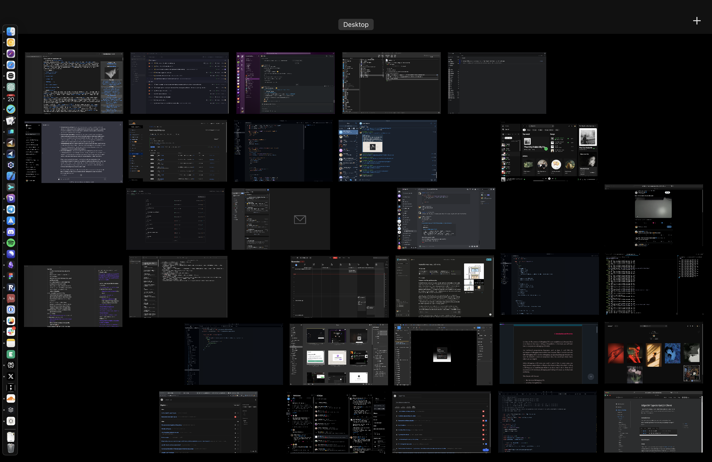
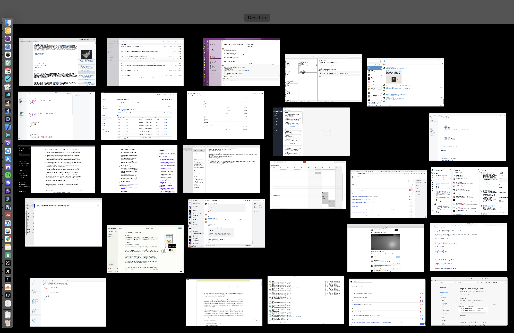

# Config (macOS / iOS)

> Apps/CLIs/configs I use on macOS/iOS. Fish, Karabiner, Cursor..

> Dark appearance. All apps are in one desktop since there is delay in switching between macOS multiple desktops. Dock is hidden.

> Light appearance. Use light themes when outside or when there is glare from the sun as it makes text more readable.

> iOS screens. All described in detail below.

- [macOS Apps](#macos-apps)
  - [Productivity](#productivity)
  - [Code](#code)
  - [Social](#social)
  - [Design](#design)
  - [Music](#music)
  - [Video](#video)
  - [Browsers](#browsers)
    - [Safari Extensions](#safari-extensions)
- [macOS CLIs](#macos-clis)
- [macOS Config](#macos-config)
- [Clean install/replicate macOS](#clean-installreplicate-macos)
- [iOS Apps](#ios-apps)
- [iOS Widgets](#ios-widgets)
- [iOS Shortcuts](#ios-shortcuts)
- [iOS Control Center](#ios-control-center)
- [WatchOS](#watchos)
- [iPad](#ipad)
- [Similar Setups](#similar-setups)
- [Related](#related)
- [Automation course](#automation-course)
- [macOS/iOS Telegram group](#macosios-telegram-group)
- [Contribute](#contribute)

## macOS Apps

<!-- TODO: link `CLIs` to wiki where it shows all the CLIs I have installed with descriptions or to file here that I parse with CLI of my own (fuzzy search command + what command/CLI does) (fish functions / CLIs / builtins / ..) (JSON?) -->

<!-- TODO: maybe do same for `apps`, can have list of all apps installed + location from where to install the app -->

Below is a list of all the [apps](https://wiki.nikiv.dev/code/config#macos-apps-i-have-installed) & [CLIs](#macos-clis) I use and how. Together with the [config](#macos-config) I use for everything.

My workflow is described in more detail in [wiki](https://wiki.nikiv.dev/sharing/my-workflow) and [course](https://macos.nikiv.dev).

### Productivity

- [Karabiner](https://wiki.nikiv.dev/macOS/apps/karabiner/) is essential tool I use to remap my keyboard. It's the tool on which my entire mac workflow is built. Essentially all the keys on my keyboard are dual purpose keys. Press once, it enters the key, hold together with another key and do custom action. I have 100's of these custom actions all within 1 second of activation for me.
- [Alfred](https://wiki.nikiv.dev/macOS/apps/alfred) for everything search related. I create many custom plugins to do specific searches I need. Also use [Raycast](https://wiki.nikiv.dev/tools/raycast) & [Script Kit](https://wiki.nikiv.dev/macOS/apps/scriptkit) (at times).
- [Keyboard Maestro](https://wiki.nikiv.dev/macOS/apps/keyboard-maestro/) for all automation needs that are not search related. Both Alfred/Raycast/ScriptKit and KM are activated from Karabiner directly. I share all my KM macros [here](https://wiki.nikiv.dev/macOS/apps/keyboard-maestro/km-macros). One example of KM macro is [using AppleScript](https://www.macobserver.com/tips/quick-tip/change-light-dark-mode-applescript-app/) to switch [between light/dark macOS appearances](https://twitter.com/nikitavoloboev/status/1311336647338983432). As appearances are switched, the themes get updated accordingly on most apps.
- [BetterTouchTool](https://wiki.nikiv.dev/macOS/apps/bettertouchtool) for custom trackpad gestures. Specifically love three finger swipe left/right to move between tabs in [Safari](https://wiki.nikiv.dev/web/browsers/safari). Three finger swipe up to create new tab. Three down to close. Four finger swipe global swipe to show Safari. Four to right to open [Cursor](https://cursor.sh). Four left to open [Warp](https://wiki.nikiv.dev/unix/shell/warp).
- [Fantastical](https://wiki.nikiv.dev/macOS/apps/fantastical) to manage my calendar and events.
- [CleanShot](https://getcleanshot.com) for quick editing of screenshots/screencasts.
- [Obsidian](https://wiki.nikiv.dev/tools/obsidian) for [note taking](https://wiki.nikiv.dev/other/wiki-workflow). Love its linking feature and various plugins it has. Also use it as a thinking scratchpad of todos.
- [Notion](https://wiki.nikiv.dev/tools/notion) for managing personal and organisational knowledge.
- [Transmission](https://www.transmissionbt.com/) for downloading [torrents](https://wiki.nikiv.dev/networking/peer-to-peer/bittorrent).
- [1Password](https://wiki.nikiv.dev/macOS/apps/1password) to keep all passwords and secret info. I prefer to use Passkeys or Single Sign On via GitHub/Google.

### Code

- [Cursor Nightly](https://www.cursor.sh/) as my main code editor. It is a fork of [VS Code](https://wiki.nikiv.dev/text-editors/vs-code) but gives nice AI features I use often. Use many [VSCode extensions](https://wiki.nikiv.dev/text-editors/vs-code/vs-code-extensions) with it. Keep my UI minimal and useful.
- [Sublime Merge](https://www.sublimemerge.com) as visual Git client. It gives nice overview of files changed, what branches exist and more. I have custom actions bound to go through Git tasks fast.
- [Warp](https://wiki.nikiv.dev/unix/shell/warp) as primary terminal together with [Fish Shell](https://wiki.nikiv.dev/unix/shell/fish).
- [Dash](https://kapeli.com/dash) to search APIs fast.
- [Pathfinder](https://pathfinder.dev/) for GraphQL requests (use [Grafbase](https://grafbase.com)). And [HTTPie](https://httpie.io/) for regular HTTP requests.
- [Xcode](https://wiki.nikiv.dev/macOS/apps/xcode/) to build [iOS](https://wiki.nikiv.dev/operating-systems/ios) apps in [SwiftUI](https://wiki.nikiv.dev/programming-languages/swift/swift-libraries/swiftui).

### Social

- [Telegram](https://wiki.nikiv.dev/tools/telegram) as my main messenger. Love its stickers, speed and simplicity.
- [Spark](https://sparkmailapp.com) as my email client. Does good job of sorting mail and getting out of my way when writing/replying to things.
- [Discord](https://wiki.nikiv.dev/tools/discord) as main way to interact with various communities.

### Design

- [Figma](https://wiki.nikiv.dev/design/figma) as my primary design tool.

### Music

- [Spotify](https://www.spotify.com) to stream all [my music](https://wiki.nikiv.dev/music). Keep all my liked songs in a [playlist](https://open.spotify.com/playlist/0ERn0U4qZIKC8Dy7RrMMsn).

### Video

- [IINA](https://github.com/lhc70000/iina) to play video files of movies/series.

### Browsers

- [Safari](https://wiki.nikiv.dev/web/browsers/safari) as main browser for everything.
- [Google Chrome Canary](https://wiki.nikiv.dev/web/browsers/google-chrome) for web development as its [dev tools](https://wiki.nikiv.dev/web/browsers/google-chrome/chrome-dev-tools) are superior to Safari.
- [Safari Technology Preview](https://developer.apple.com/safari/technology-preview/) as browser for my [X](https://wiki.nikiv.dev/tools/twitter) feed and sometimes dev.

## macOS CLIs

Use [Brew](https://wiki.nikiv.dev/package-managers/brew) and global [Bun](https://bun.sh) packages for most of my CLIs. Eventually want to settle down on [Nix](https://wiki.nikiv.dev/package-managers/nix) as I learn it more.

I try to keep my macOS declarative. Currently it's one [magefile.go](magefile.go) but it's not up to date. Most likely be moved to [chezmoi](https://www.chezmoi.io/).

I list CLIs I use [here](https://wiki.nikiv.dev/cli).

## macOS Config

All config files are part of this repo. They include configs for [fish](fish), [karabiner](karabiner), [git](git) and more. Configs for tools I stopped using are in [archive](archive).

## Clean install/replicate macOS

1. Boot latest macOS version. Remember that username is the name you want the home folder to be (by default its first name & last name). Mine is `nikiv`.
<!-- TODO: needs update -->
2. Go through [preferences](https://imgur.com/a/KoVAxFQ) & set everything up.
3. Download & install apps I use (mentioned above).
4. Sync/link all config files.

<!-- TODO: needs update/testing -->

Take a look at [install](install) shell script. It will install [brew](https://brew.sh), [go](https://go.dev) & [mage](https://github.com/magefile/mage).

Run it with `./install`. As part of the script it will run `mage setup`. Take a look at [magefile.go](magefile.go) `Setup` function to see what it will do.

You can also run `mage` alone to see what commands you can run with descriptions of them.

In short, it will create appropriate symlinks pointing at files in `~/.dotfiles`. It is assumed that the dotfiles repo is placed there.

It will also install CLI tools & apps.

5. [Sync settings](https://github.com/zenangst/Syncalicious) for apps I use.

## iOS Apps

I only use 2 active spaces on my phone without any folders to minimize hand movement. Everything is optimized for reachability and partly aesthetics. I nearly always use dark mode as I prefer it unless I am outside and it's hard to read the text.

I minimize push notifications to nearly only messaging apps (Telegram/Discord/..). I also keep it nearly always on Do Not Disturb mode. Especially when I work on my mac and keep the phone on the side so as to not duplicate notifications.

Apps are listed in order they appear in each of the screens.

- [Fantastical](https://wiki.nikiv.dev/macOS/apps/fantastical) widget to see my current and upcoming events. I click on the widget to open the app itself to make new events or see full week/month view of events.
- App Store to search for apps to download and sometimes check and manually trigger updates for all apps as iOS does not often do it automatically.
- Settings to connect to Wi-Fi mostly or tweak settings.
- Files to search for files like books/PDFs/.. in ~/Documents and ~/Desktop.
- [Spark](https://sparkmailapp.com) to check on mail. Don't have notifications set for emails.
- [GitHub](https://github.com/mobile) to check on notifications, reply to issues or search for repos/issues.
- [Notion](https://wiki.nikiv.dev/tools/notion) for managing personal and organisational knowledge.
- Photos to see/search photos I took and saved. Love its Memories feature.
- [Google Maps](https://itunes.apple.com/us/app/google-maps-transit-food/id585027354) for navigating around the world. Saving [lists of places I want to visit and places I loved seeing](https://wiki.nikiv.dev/travel/visited).
- [Audible](https://itunes.apple.com/us/app/audible-audio-books-podcasts/id379693831?mt=8) to listen to audio books.
- Reddit to read new posts or do searches
- [Instagram](https://wiki.nikiv.dev/social-networks/instagram) to [share photos/videos](https://www.instagram.com/nikitavoloboev/) in form of stories/posts.
- Notes to write down quick notes or ideas.
- [Overcast](https://overcast.fm) to listen to [podcasts I like](https://wiki.nikiv.dev/podcasts). I love its [smart speed](https://medium.com/@eped/overcasts-smart-speed-vs-real-time-a759549ab48b#.f05tiojfo) feature to cut out on silent pauses.
- [Reader](https://readwise.io/read) to read PDFs/ePubs + RSS feeds.
- X to read posts, search and messages
- [Perplexity](https://www.perplexity.ai/) to make search queries. Replacement for Google mostly.
- [Slack](https://wiki.nikiv.dev/tools/slack) to check up on communities I am in. Prefer Discord.
- [Spotify](https://www.spotify.com) to stream all [my music](https://wiki.nikiv.dev/music) and some exclusive podcasts.
- [Telegram](https://wiki.nikiv.dev/tools/telegram) to chat and read groups/channel updates.
- [Discord](https://wiki.nikiv.dev/tools/discord) to check up on communities I am in.
- [Things](https://culturedcode.com/things/) to add todos. On macOS I use [2Do](https://www.2doapp.com/) as its superior. In future, will only use [LA Todos](https://github.com/learn-anything/todo).
- [Safari](https://wiki.nikiv.dev/web/browsers/safari) for all web browsing. Keep [top sites in bookmarks bar for fast access](https://i.imgur.com/uDjnhwX.jpg).
- [ChatGPT](https://apps.apple.com/us/app/chatgpt/id6448311069) to ask questions of all kind (textual / audio / visual).
- [Trading 212](https://www.trading212.com) to to buy/sell stocks/ETFs.
- [1Password](https://wiki.nikiv.dev/macOS/apps/1password) to search for passwords/notes/..
- [Luma](https://lu.ma/) to check on events.
- [Tailscale](https://tailscale.com/) to connect to my exit node server that I use as my VPN in places I need a VPN. Use [Bitfolk](https://bitfolk.com/) for my server.
- [Bluesky](https://blueskyweb.xyz/) to read posts.
- [Mastodon](https://joinmastodon.org/) to read posts.
- [Solflare](https://solflare.com/) to send Solana. It also has Safari extension I use to connect to some Solana apps.
- Phone to search for some contact or update some contact info or add new contact.
- Skyscanner to search for flight tickets.
- Booking to search for hotels to stay in.
- Airbnb to search for rooms to stay in.
- Wise as my primary bank. Sending money and checking on past transactions.
- CapCut to edit videos
- VSCO to edit photos
- Pinterest to see posts and organise them into collections
- YouTube to see/search videos
- Uber to get a ride to some place
- Glass to see photographs and post some
- TikTok to see videos
- Cosmos to see new posts

2 pages is often enough to have nearly all apps I need within super fast access. However I do have last third page of 'other' apps.

<!-- TODO: add other apps -->
<!-- - [Wipr](https://itunes.apple.com/us/app/wipr/id1030595027) - Safari ad blocker -->

## iOS Widgets

I use 3 widgets in lock screen.

- Show upcoming event with Fantastical
- Create new task with [Things](https://culturedcode.com/things/)
- Create new event with Fantastical

I keep common shortcut actions as widgets on the side (just need to scroll left to access):

## iOS Shortcuts

I color all [shortcuts](https://support.apple.com/guide/shortcuts/welcome/ios) I use with gray color for consistency.

- [Shortcuts](https://www.icloud.com/shortcuts/6dd13bc13cd14a30b2577dbd6816f39a) - Open Shortcuts app
- [Next](https://www.icloud.com/shortcuts/566ac7c0e414428aaa2c2b391357affc) - Get Google Maps directions for next event
- [Phone](https://www.icloud.com/shortcuts/24c85af28dd041b3ae1d143f1b3c44d4) - Open Phone app
- [Places](https://www.icloud.com/shortcuts/2cb21d99b8314e7a8231c634c7876ece) - Search for Restaraunts/Attractions/.. on Google Maps
- [Ride/Food](https://www.icloud.com/shortcuts/8e9560d24b0c4087b0c40b989799e9fb) - Open Uber app
- [Translate](https://www.icloud.com/shortcuts/0cf085c93795473d89833b7bbbb2c254) - Open Google Translate app
- [Weather](https://www.icloud.com/shortcuts/486c35625d5045d08f5a01164e7d80b6) - Open Weather app
- [Workout](https://www.icloud.com/shortcuts/669d5a52700f4ab09255966cc96e31bc) - Open [Caliber](https://caliberstrong.com) app
- [Sort](https://www.icloud.com/shortcuts/e64c50fa3f4746bb9c0cdb2624077ed9) - Open [Slidebox](http://slidebox.co) app
- [Photo](https://www.icloud.com/shortcuts/39c4e384596b4b2fa20a10c8c8512190) - Open Camera app
- [Podcast](https://www.icloud.com/shortcuts/28799800f81f42d68f42849c129834fe) - Start playing [Overcast](https://overcast.fm) podcast
- [Voice](https://www.icloud.com/shortcuts/960ebd64ee76488b96bf50ad7513e063) - Start voice conversation with ChatGPT
- [Memos](https://www.icloud.com/shortcuts/77865133130d4e16b8f6edf46b0e1a83) - Open Voice Memos app
- [Record](https://www.icloud.com/shortcuts/14e3dbd846f54270ac699ab6e0ef661e) - Create voice recording
- [Focus](https://www.icloud.com/shortcuts/3a919eba5e254436be827bf4a51b0e0c) - Open [Endel](https://endel.io) app
- [Contacts](https://www.icloud.com/shortcuts/9ccbfdc7897f47259c493a39fea13ed5) - Start searching [Cardhop](https://flexibits.com/cardhop) for contacts

I use `Test` shortcut to prototype new actions/ideas quickly. I then duplicate the working prototype & give it appropriate name. I use the same prototyping idea with [KM macros](https://wiki.nikiv.dev/macOS/apps/keyboard-maestro/km-macros).

## iOS Control Center

Here is how my control center looks:

## WatchOS

I stopped wearing a watch. But when I did I mostly used it to track my health and fitness and view useful information at a glance like current time and events.

I used only one Infograph Modular watch face. It showed the current time and day, the weather and my current or future calendar events (with [Fantastical](https://flexibits.com/fantastical)). It also let me quickly start cardio workout (running/biking) or bodyweight workout (with [Streaks Workout](https://streaksworkout.com)). I could also start a timer or see the time of a timer if one is already running.

## iPad

I don't use iPad either. When I did, I mostly used it to draw with [Procreate](https://procreate.art) or noting/sketching in [Notes](https://www.icloud.com/notes)/[Muse](https://museapp.com/) with the pencil. I also sometimes used it as second screen with [Sidecar](https://support.apple.com/en-me/HT210380).

## Automation course

I describe my macOS/iOS setup in greater detail in [my course](https://macos.nikiv.dev).

## macOS/iOS Telegram group

I made a [Telegram group](https://t.me/joinchat/BBKnQU4_rty6_942PFbPbw) to discuss all things macOS/iOS.

And I have a [personal Discord](https://discord.com/invite/TVafwaD23d) where you can for ask questions about this repo and [others](https://github.com/nikitavoloboev#src).

## Contribute

Whilst this is a personal config/setup, I am always open to useful suggestions/ideas or new tools/apps.

Can [open new issue](../../issues/new/choose) (search [existing issues](../../issues) first) or [start discussion](../../discussions).

Join [Discord](https://discord.com/invite/TVafwaD23d) for more indepth discussions on this repo and [others](https://github.com/nikitavoloboev#src).

### 🖤

[Support on GitHub](https://github.com/sponsors/nikitavoloboev) or look into [other projects](https://nikiv.dev/projects).

 
